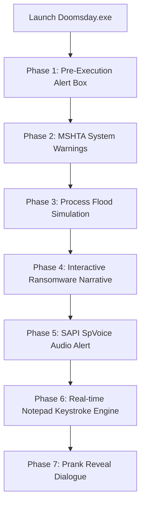

# ☣️ Project-Doomsday

**An Interactive & Harmless Simulated Ransomware Experience for Windows Systems**

[-FF5722?style=for-the-badge)](https://en.wikipedia.org/wiki/Executable)

 

`#cybersecurity` `#windows-automation` `#simulator` `#prank-script` `#vbscript` `#security-awareness` `#project-doomsday`

---

### 🚨 DISCLAIMER
> **FOR EDUCATIONAL, DEMONSTRATION, AND ENTERTAINMENT PURPOSES ONLY.**
>
> **Project-Doomsday** is a 100% harmless prank executable designed to simulate a security breach / ransomware infection. **It does NOT encrypt, modify, exfiltrate, or destroy any actual user files or system configurations.**

---

## 📌 Overview

**Project-Doomsday** is a lightweight, non-destructive standalone Windows executable (`.exe`). Package-built using native Windows deployment tools, it wraps an automation framework leveraging system APIs to craft a hyper-realistic cyber incident simulation complete with custom warning popups, audio-visual feedback, multi-process spawning, system voice synthesis, and real-time terminal keystroke emulation.

---

## 🌟 Key Features

| Feature | Description |
| :--- | :--- |
| **🚨 Pre-Execution Custom Alert** | Built-in system popup dialog initializing before payload execution. |
| **💥 Standalone Executable** | Self-contained `.exe` binary package requires no external script runners. |
| **🌀 Resource Load Emulation** | Spawns multiple core Windows utilities (`Notepad`, `Calc`, `MSPaint`, `MS Edge`) to simulate visual chaos. |
| **🔊 Native Voice Synthesis** | Integrated SAPI `SpVoice` text-to-speech module delivering real-time audio security warnings. |
| **⌨️ Keystroke Automation** | Advanced typing-delay algorithm inside Notepad mimicking live remote desktop interaction (`RAT`). |
| **🔒 Safe Termination** | Gracefully concludes with a clear prank reveal without requiring system reboot or cleanup. |

---

## 🔄 Execution Flow

---

## 🛠️ Installation & Usage

### 📋 Prerequisites
- **Operating System:** Windows 7 / 8 / 10 / 11

### 🚀 Running the Executable

1. **Clone or Download the Repository:**
   Download the repository archive directly to your local system.

2. **Run the Application:**
   Double-click `Doomsday.exe` to trigger the simulation.

---

## 🛡️ Security & AV Note

Because this package utilizes compiled Windows system calls (`mshta`, `SendKeys`, `SAPI.SpVoice`) inside an IExpress self-extracting wrapper, some Antivirus / EDR engines may flag custom `.exe` wrappers as generic PUPs (Potentially Unwanted Programs).

* You can review the underlying build script or compile your own package directly using the provided source VBScript and Windows IExpress utility.

---

## 👤 Developer Profile

| **Lead Developer** | **GitHub Profile** | **Project Repository** |
| :---: | :---: | :---: |
| **Majid** | [@epicmajid](https://github.com/epicmajid) | [Project-Doomsday](https://github.com/epicmajid/Project-Doomsday) |

---

## 🏷️ Topic Tags & Keywords

`#ProjectDoomsday` `#CyberSimulation` `#SecurityAwareness` `#WindowsAutomation` `#SafeMalwareSimulation` `#VBScript` `#RedTeamLab` `#MajidProjects`

---

## 📜 License

Distributed under the **MIT License**. See [`LICENSE`](LICENSE) for more information.

  Created  by <a href="https://github.com/epicmajid">@epicmajid</a>

